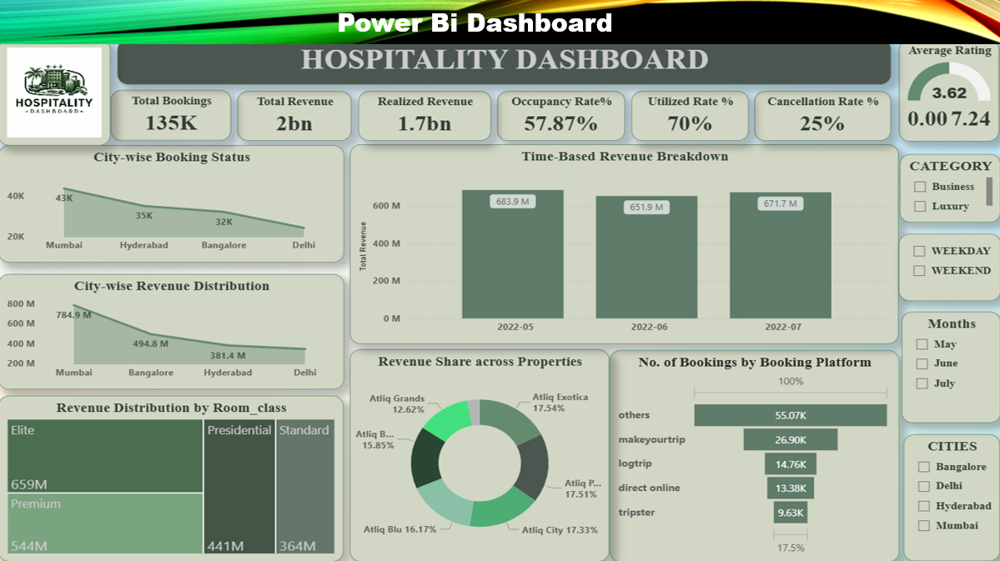
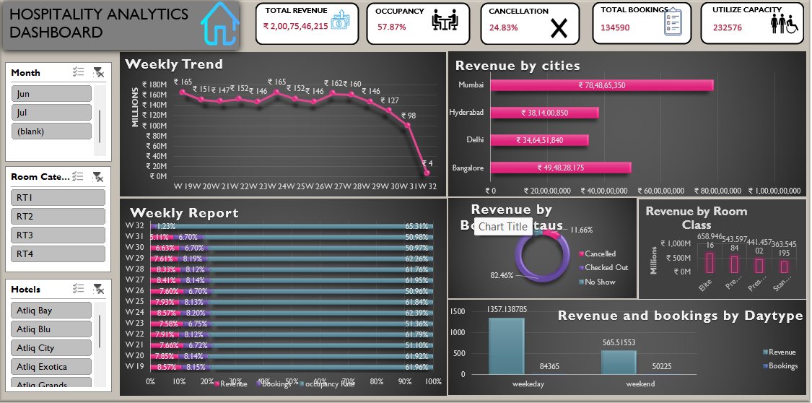

<h1 align="center">🏨 Hospitality Analytics & Revenue Optimization Dashboard</h1> <h3 align="center">Chiranth K J | Business & Data Analyst</h3> 
    

📌 Project Overview

This project analyzes hotel booking and revenue data to evaluate occupancy performance, cancellation trends, revenue distribution, and customer booking behavior.

The dashboard simulates a real-world hotel revenue management system, enabling decision-makers to monitor KPIs and optimize pricing, occupancy, and distribution channels.

🎯 Business Objectives

Monitor Total Revenue, Realized Revenue, and Booking Volume

Track Occupancy Rate and Utilization Capacity

Analyze Cancellation Trends and Revenue Leakage

Compare City-wise Revenue Performance

Identify High-Performing Room Categories

Evaluate Weekday vs Weekend Revenue Contribution

📊 Key KPIs Tracked

From the dashboard:

📌 Total Bookings: 135K+

💰 Total Revenue: ₹2.00+ Billion

💵 Realized Revenue: ₹1.7+ Billion

🏨 Occupancy Rate: 57.87%

📉 Cancellation Rate: ~25%

📊 Utilized Capacity: 70%

⭐ Average Rating: 3.62

🛠 Tools & Technologies Used

Power BI

DAX Measures (Revenue, ADR, Occupancy %, Utilization %)

KPI Cards & Drill-Down Filters

Time-Based Revenue Analysis

Category & City-wise Performance Analysis

Microsoft Excel

Pivot Tables & Pivot Charts

Revenue Breakdown Analysis

Weekly Trend Analysis

Room Class Performance Comparison

🔍 Detailed Analysis Performed
1️⃣ City-Wise Revenue & Booking Analysis

Mumbai generated the highest revenue contribution (~₹78M+)

Bangalore and Hyderabad showed strong mid-tier performance

Delhi recorded comparatively lower booking volume

2️⃣ Time-Based Revenue Breakdown

Revenue analyzed month-wise (May–July)

Stable revenue performance across peak months

Identified seasonal booking fluctuations

3️⃣ Revenue Distribution by Room Class

Elite and Premium categories generated the highest revenue

Presidential rooms had high ADR but lower booking frequency

Standard rooms showed volume-driven revenue contribution

4️⃣ Booking Platform Analysis

Majority bookings came from third-party platforms

Direct online bookings had lower share

Opportunity identified to improve direct channel revenue

5️⃣ Weekly & Day-Type Analysis

Weekday revenue significantly higher than weekend revenue

Revenue drop observed in later weeks indicating seasonal impact

💡 Key Business Insights

High cancellation rate (~25%) is causing revenue leakage

Premium room classes drive profitability

Third-party booking dependency increases commission costs

Dynamic pricing strategy recommended for peak demand periods

Improving direct bookings could increase realized revenue by 5–8%

📸 Dashboard Screenshots
📈 Power BI Dashboard

  

📊 Excel Analytics Dashboard

  

📦 Deliverables

Interactive Power BI Dashboard (.pbix)

Excel Analytical Model

Cleaned Hospitality Dataset

Revenue Optimization Recommendations

Business KPI Documentation

📈 Business Impact Simulation

Based on analytical insights:

Potential Revenue Improvement: 6–10%

Reduced Cancellation Impact through policy optimization

Improved Channel Strategy for Direct Bookings

Enhanced Pricing Decisions using demand patterns

👤 Author

Chiranth K J

GitHub: https://github.com/Chirugow

LinkedIn: https://www.linkedin.com/in/chiranthkj/

Portfolio: https://chirugow.github.io
